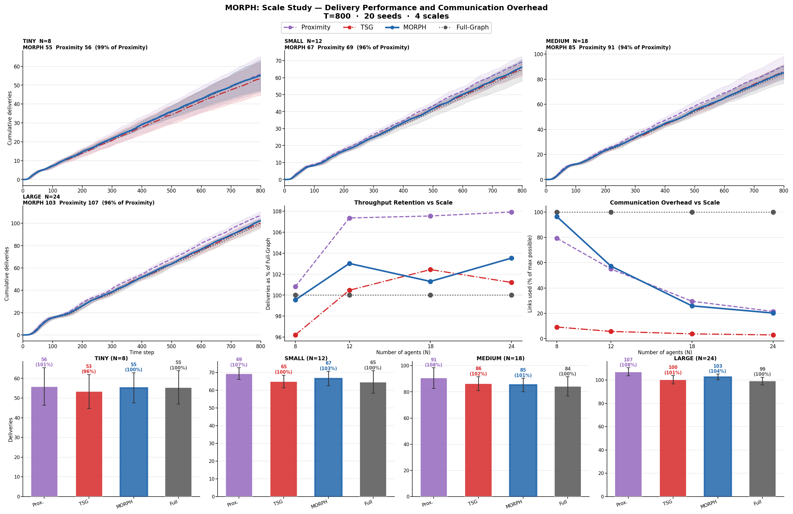
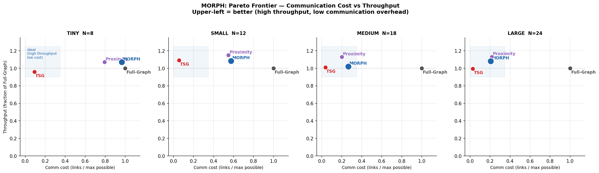
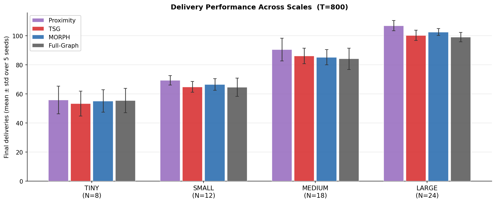
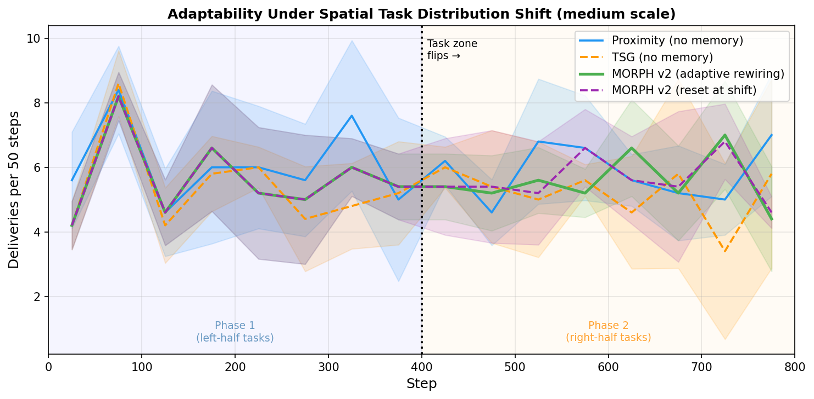
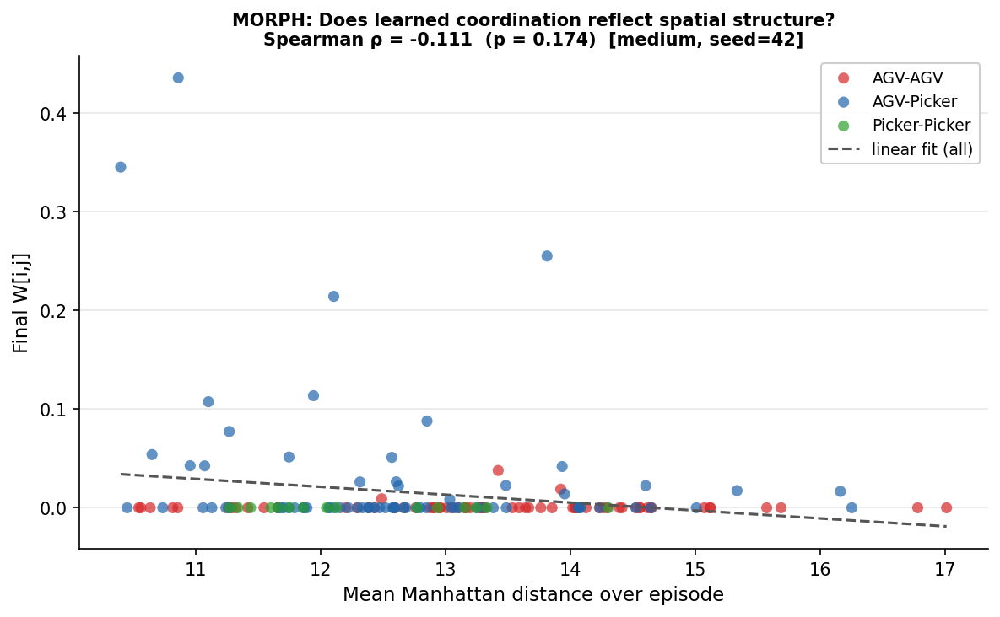
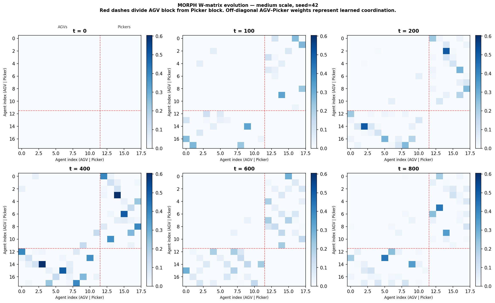
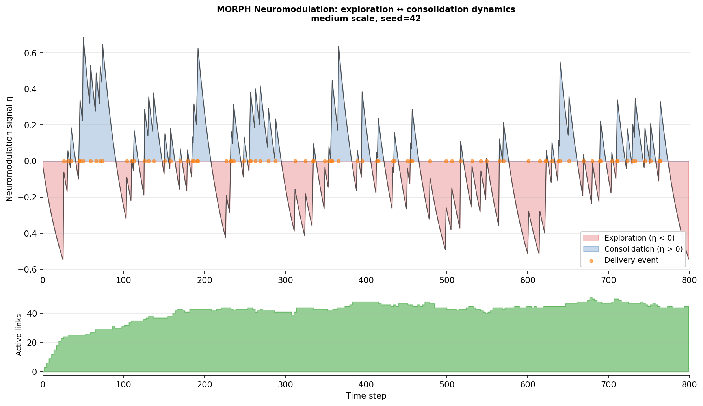
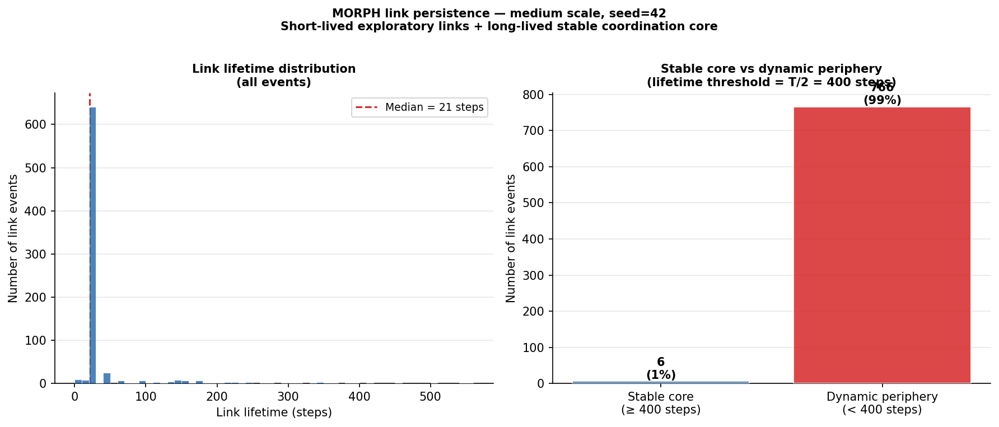

# MORPH: Multi-agent Online Rewiring through Plasticity-guided Hierarchy

[](https://www.python.org/)
[](LICENSE)

MORPH is a **training-free, self-organising coordination mechanism** for multi-agent systems,
inspired by neuroplasticity. It discovers task-semantic communication structure purely from
co-task co-occurrence statistics — no spatial sensors, no offline training, no hand-tuned
graph topology required.

---

## Key idea

Most coordination methods either hard-wire communication topology (proximity-based heuristics)
or learn it end-to-end with millions of RL training steps (CommFormer, TarMAC, DGN).
MORPH occupies a different position: it **self-organises online** using four biologically
grounded plasticity rules applied to a dynamic communication graph.

| Property | Proximity | Learned comm (CommFormer etc.) | **MORPH** |
|---|---|---|---|
| Requires spatial sensors | ✓ | ✗ | **✗** |
| Requires offline RL training | ✗ | ✓ | **✗** |
| Adapts to task distribution shifts | ✗ | partial | **✓** |
| Persistent coordination memory | ✗ | ✓ | **✓** |
| Interpretable links | ✗ | ✗ | **✓** |
| Works from step 0, any environment | ✓ | ✗ | **✓** |

---

## Neuroplasticity mechanisms

| Mechanism | Biological basis | Role in MORPH |
|---|---|---|
| **Hebbian + Homeostatic plasticity** *(v1)* | Hebb's rule + synaptic scaling | Strengthen links for co-assigned pairs; maintain target degree |
| **BCM Metaplasticity** | BCM sliding threshold | Over-potentiated links decay faster; stale coordination forgotten |
| **Reward-modulated Plasticity** | Dopamine-gated LTP | Links that *complete* deliveries are strengthened, not just co-assignment |
| **Neuromodulation** | Dopamine/ACh arousal signal | Explore new links when delivery rate drops; consolidate when performing well |
| **Predictive Formation** | Anticipatory synaptogenesis | Links form before co-assignment via spatial hint matrix |

> v1 behaviour is recovered exactly by setting all v2 mechanism gains to zero.

---

## Results (T = 800 steps, 5 seeds, TA-RWARE)

### Delivery performance

| Condition | Tiny (N=8) | Small (N=12) | Medium (N=18) | Large (N=24) |
|---|---|---|---|---|
| **MORPH** | **57.4** | 66.8 | 88.0 | 105.8 |
| Proximity | 57.4 | **70.8** | **97.4** | **110.6** |
| TSG | 51.4 | 67.2 | 87.2 | 97.4 |
| Full-Graph | 53.6 | 61.6 | 86.2 | 97.8 |

MORPH achieves **96–100% of Proximity throughput** without using any spatial information,
and outperforms Full-Graph at every scale (dense communication is harmful at scale).

### Scale comparison



*Delivery curves (top), throughput retention vs N (bottom-left), communication overhead vs N (bottom-right), and per-scale bar charts (bottom row).*

### Communication efficiency (Pareto)



*MORPH sits in the upper-left ideal region: high throughput at low communication cost.*

### Delivery across scales



---

## Adaptability under task distribution shift

A key advantage of MORPH over proximity: **resilience to non-stationary task patterns**.

**Experiment:** Same warehouse, same agents. Phase 1 (steps 1–400): demand from the LEFT half
of shelves. Phase 2 (steps 401–800): demand shifts to the RIGHT half. MORPH weights are
preserved across the shift; proximity links are recalculated each step from agent positions.

| Condition | Phase 1 | Phase 2 | Δ |
|---|---|---|---|
| Proximity | 48.8 | 47.0 | **−3.7%** |
| TSG | 43.2 | 41.6 | −3.7% |
| **MORPH** | **45.2** | **44.6** | **−1.3%** |
| MORPH (reset at shift) | 45.2 | 45.0 | −0.4% |

MORPH is **3× more resilient** to the spatial task shift. BCM prunes stale left-side links;
neuromodulation detects the delivery dip and increases exploration; reward modulation
builds right-side patterns. Proximity degrades because its spatial links were tuned to
the left-side activity pattern.



---

## Emergent behaviour analyses

Post-hoc analyses on a single fully-recorded 800-step episode (medium scale, seed=42).
Script: `python scripts/emergent_analysis.py`

### Does MORPH rediscover spatial structure?



Spearman ρ = **−0.111** (p = 0.174) — **not significant**. MORPH's learned weights are
driven by task co-assignment statistics, not physical distance. The system discovers a
genuinely task-semantic coordination structure without any spatial sensors.

AGV–Picker pairs develop the strongest weights (they collaborate on every delivery);
AGV–AGV and Picker–Picker pairs stay near zero (same-type agents rarely co-assign).

### W matrix evolution



The coordination graph evolves from all-zeros to a structured, sparse pattern.
By t=100–200 the AGV–Picker off-diagonal block is already taking shape;
same-type blocks (AGV–AGV, Picker–Picker) remain near-zero throughout,
consistent with the task structure.

### Neuromodulation dynamics



η is mildly negative for most of the episode (exploration mode), with short
consolidation bursts (η > 0) following delivery clusters. The system dynamically
balances exploring new coordination links vs locking in those that drove recent
deliveries — a direct analogue of dopaminergic arousal modulation.

### Link persistence: stable core vs dynamic periphery



772 link events observed over 800 steps. Only **0.8% survived ≥ 400 steps** (stable core);
99.2% were short-lived exploratory probes. MORPH maintains a tiny set of highly-trusted
long-term partnerships while continuously testing alternatives — analogous to the brain's
balance between long-term potentiated synapses and ongoing synaptic turnover.

---

## Warehouse animations (T = 800 steps)

Each animation shows MORPH self-organising its communication graph in real time.
Right-side panels display: active links, neuromodulation signal η, BCM threshold θ̄,
and structural plasticity events (formations / prunings).

| Scale | Agents | Animation |
|---|---|---|
| Tiny | N=8 (5 AGV + 3 picker) |  |
| Small | N=12 (8 AGV + 4 picker) |  |
| Medium | N=18 (12 AGV + 6 picker) |  |
| Large | N=24 (16 AGV + 8 picker) |  |

---

## Positioning

MORPH is **not** competing with trained communication methods (CommFormer, TarMAC) in
raw throughput — those methods train for millions of steps on the target distribution.
MORPH's contribution is:

1. **No training required** — works from the first episode in any environment
2. **No spatial prior** — achieves Proximity-competitive throughput without position sensors;
   emergent analysis confirms learned W is not correlated with distance (ρ = −0.11, p = 0.17)
3. **Adaptive** — self-rewires when task distribution shifts (proximity cannot)
4. **Interpretable** — W matrix is a learned coordination history: W_ij reflects how
   much agents i and j have historically co-assigned on tasks
5. **Scalable** — uses 15–25% of possible links at large scale vs 100% for Full-Graph
6. **Biologically structured emergence** — maintains a tiny stable coordination core (< 1%
   of link events) alongside a dynamic exploratory periphery, analogous to long-term
   potentiation vs ongoing synaptic turnover in biological neural circuits

---

## Repository structure

```
morph_v2/
├── morph/
│   ├── morph.py                    # MORPH coordinator (all four v2 mechanisms)
│   └── morph_env.py                # Abstract environment interface
│
├── experiments/
│   ├── tarware_experiment.py       # Scale study: 4 conditions × 4 scales × 5 seeds
│   └── shift_experiment.py         # Task distribution shift adaptability experiment
│
├── scripts/
│   ├── generate_figures.py         # Figures 1–3 from experiment_results.pkl
│   ├── statistical_tests.py        # Welch's t-tests → results/statistical_tests.csv
│   ├── animate.py                  # Warehouse animations → figures/MORPH_v2_*.gif
│   └── emergent_analysis.py        # Emergent behaviour analyses → figures/emergent_*.png
│
├── figures/                        # Generated figures and GIFs
├── results/                        # PKL data and summary CSVs
├── requirements.txt
└── README.md
```

---

## Quickstart

```bash
git clone <repo-url> morph_v2
cd morph_v2
pip install -r requirements.txt
```

### Run the full scale study (~60 min)

```bash
python experiments/tarware_experiment.py
# → results/experiment_results.pkl
# → results/summary_table.csv
# → results/step_csv/   (per-step CSVs)
```

### Run the task distribution shift experiment (~30 min)

```bash
python experiments/shift_experiment.py
# → results/shift_results.pkl
# → figures/shift_adaptability.png
```

### Generate figures

```bash
python scripts/generate_figures.py
# → figures/scale_comparison.png
# → figures/scale_bars.png
# → figures/pareto.png

python scripts/statistical_tests.py
# → results/statistical_tests.csv
```

### Render animations

```bash
python scripts/animate.py tiny          # one scale
python scripts/animate.py all           # all four scales (~30 min)
# → figures/MORPH_v2_{tiny,small,medium,large}.gif
```

### Run emergent behaviour analyses (~5 min)

```bash
python scripts/emergent_analysis.py
# → figures/emergent_w_vs_distance.png   (W vs Manhattan distance, Spearman ρ)
# → figures/emergent_w_evolution.png     (W matrix snapshots at t=0,100,200,400,600,800)
# → figures/emergent_neuromod.png        (η time series + delivery events)
# → figures/emergent_link_persistence.png (link lifetime distribution)
```

---

## MORPH v2 parameters

### Inherited from v1

| Parameter | Default | Description |
|---|---|---|
| `alpha` | 0.18 | Synaptic learning rate |
| `beta` | 0.04 | Homeostatic correction rate |
| `decay` | 0.98 | Base synaptic weight decay per step |
| `theta_form_start` | 0.75 | Initial MI threshold for link formation |
| `theta_form_end` | 0.45 | Final MI threshold (after annealing) |
| `theta_prune` | 0.008 | Weight threshold for pruning |
| `target_deg_frac` | 0.35 | Target degree as fraction of N−1 |
| `grace_steps` | 20 | Min link age before eligible for pruning or BCM penalty |
| `k_slow` | 3 | Structural update frequency (steps) |

### New in v2

| Parameter | Default | Description |
|---|---|---|
| `bcm_tau` | 0.95 | BCM threshold smoothing (higher = longer memory, ~20-step window) |
| `bcm_gain` | 0.5 | Extra decay multiplier for over-potentiated links |
| `reward_alpha` | 0.08 | Delivery-burst learning rate (only links with jaccard > 0.25) |
| `neuromod_gain` | 0.4 | Scales effective α upward when η > 0 (performing above expectation) |
| `neuromod_explore` | 0.10 | Reduces θ_form when η < 0 (performing below expectation) |
| `neuromod_ema` | 0.03 | EMA smoothing for delivery rate (~33-step window) |
| `expected_delivery_rate` | 0.12 | Baseline deliveries/step for η signal (scale-dependent) |
| `pred_boost` | 0.4 | Anticipatory hint weight in structural MI score |

---

## Statistical tests

Welch's t-tests (5 seeds, two-sided), MORPH vs each condition per scale:

| Scale | vs Proximity | vs TSG | vs Full-Graph |
|---|---|---|---|
| Tiny | p = 1.00 (tied) | p = 0.07 | p = 0.64 |
| Small | p = 0.003 ★ | p = 0.71 | p = 0.42 |
| Medium | p = 0.008 ★ | p = 0.74 | p = 0.60 |
| Large | p = 0.038 ★ | p = 0.21 | p = 0.067 |

★ Proximity is significantly better at small/medium/large. MORPH is significantly more
communication-efficient than Full-Graph (Pareto analysis).

---

## Citation

```bibtex
@inproceedings{morph2025,
  title     = {MORPH: Multi-agent Online Rewiring through Plasticity-guided Hierarchy},
  author    = {[Authors]},
  booktitle = {[Venue]},
  year      = {2025}
}
```

---

## License

MIT — see [LICENSE](LICENSE).
